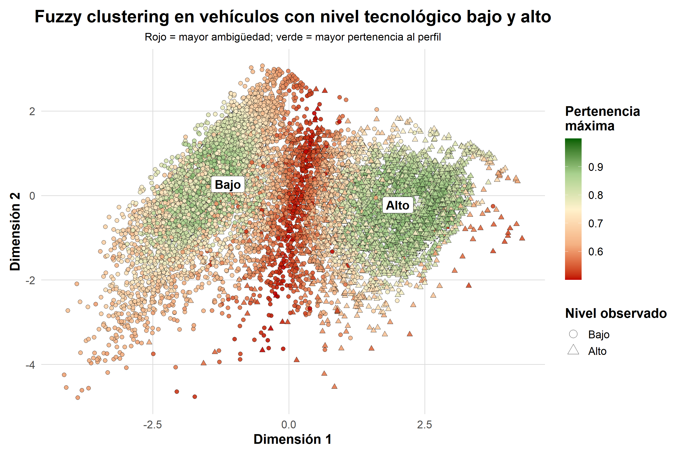
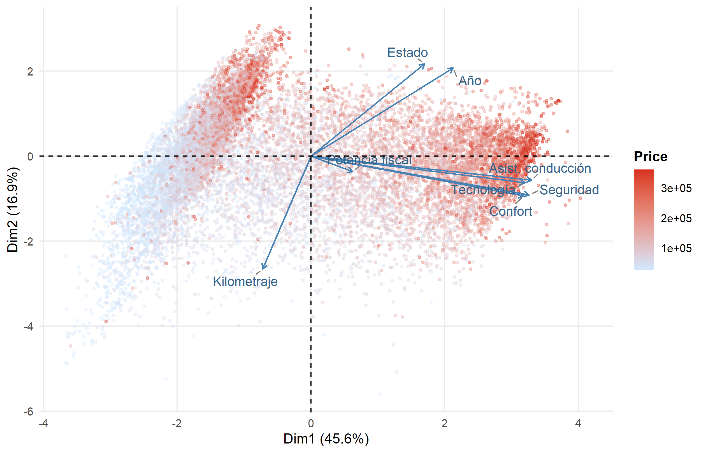
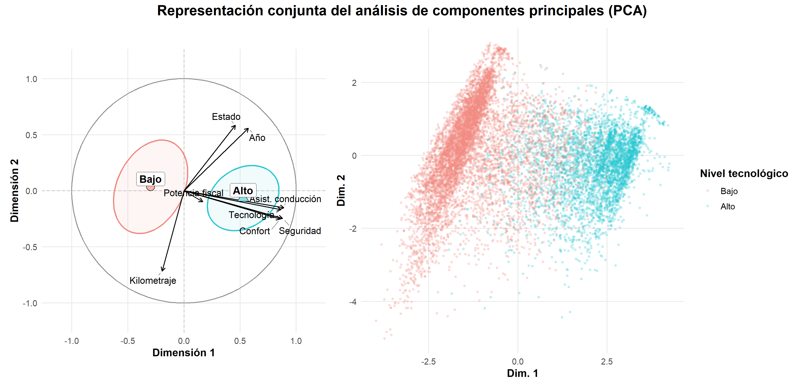

# Machine Learning for Classification and Regression

Selected coursework material on supervised learning, with an emphasis on data preparation, model comparison and clear evaluation.

## Topics covered
- binary classification
- regression
- cross-validation
- model selection
- confusion matrices, ROC-style evaluation and supporting visualizations
- comparison between several classification families detected in the source material, including tree-based models, random forest, k-nearest neighbours, SVM-style classifiers and logistic-regression workflows

## Included here
- curated RMarkdown source files
- a small selection of safe figures
- short documentation on source material and excluded artifacts

## Visual preview

The public version includes representative figures from the coursework, including binary-classification structure and regression-oriented PCA views.

## Source-note on models

During review of the original coursework folder, the underlying material showed evidence of several supervised-classification workflows rather than a single model family. The public export therefore presents this repository as a model-comparison coursework project, even when only a limited figure subset is published.

## Data availability
Raw tables, spreadsheets and serialized model artifacts are not published in this repository.

## Reproducibility note
Exact reproduction would require the original course datasets or a public substitute with the same schema.
