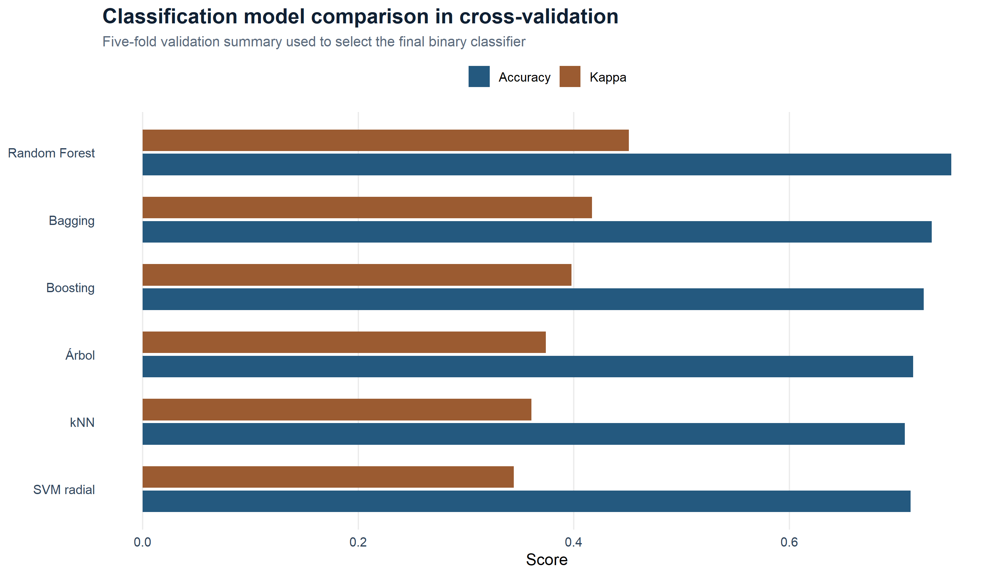
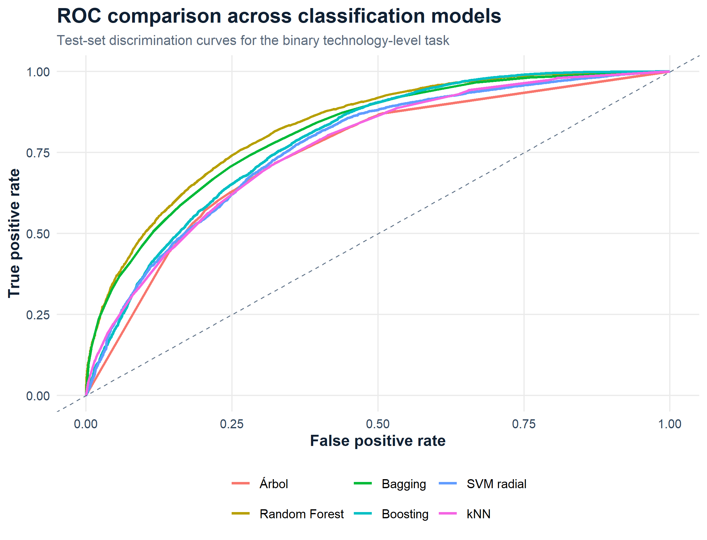
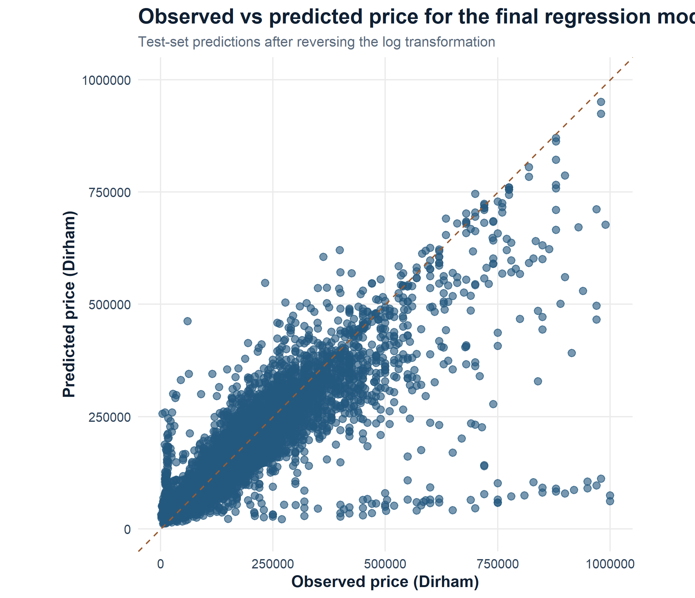

# Machine Learning for Classification and Regression

Selected coursework material on supervised learning, unsupervised support analysis and predictive modelling, with an emphasis on data preparation, model comparison and clear evaluation.

## Project scope

The project is organized around three connected blocks:

1. binary classification;
2. unsupervised analysis for structural interpretation;
3. regression for price prediction.

The public repository reflects that structure instead of showing only a small visual subset.

## Topics covered

- binary classification;
- regression;
- train/test splitting and cross-validation;
- dummy-variable encoding and feature preparation;
- comparison between several classification families;
- comparison between several regression families;
- confusion matrices, ROC analysis and AUC;
- PCA and fuzzy clustering as interpretability support;
- variable importance, REC curves and SHAP-style local explanations.

## Model families covered in the project

Classification:

- decision tree;
- random forest;
- bagging;
- boosting;
- SVM radial;
- kNN.

Regression:

- linear regression;
- regression tree;
- random forest;
- XGBoost;
- SVM radial;
- kNN.

## Included here

- curated R Markdown source files;
- a reference classification script extracted from the coursework folder;
- a compact regression workflow script aligned with the final report;
- a public R script that regenerates safe result figures from the final stored coursework outputs;
- supporting exploratory figures used to interpret classification and regression structure;
- documentation explaining methodology and results;
- a selection of safe figures.

## Repository structure

- `notebooks/trabajo.Rmd`
  Main coursework-derived report.
- `src/reference_classification_model_gallery.R`
  Reference script showing the classification model families explored in the source folder.
- `src/regression_modeling_workflow.R`
  Compact public script describing the regression workflow and model comparison.
- `src/generate_public_result_figures.R`
  Helper used to regenerate public-safe ROC, cross-validation and regression-summary figures from the original private result objects.
- `docs/methodology_overview.md`
  High-level explanation of the pipeline.
- `docs/results_summary.md`
  Main findings from classification, unsupervised analysis and regression.
- `figures/`
  Public-safe visual outputs used in the report and the portfolio website.

## Visual preview

This repository keeps a short set of representative figures rather than a full dump of coursework charts.
The selected visuals show the model-comparison logic in classification, the discrimination behaviour of the final classifier, the structural interpretation used in regression and the agreement between observed and predicted prices.

## Main findings retained in the public version

- in our project, `Random Forest` was the strongest classification model, with the best overall behaviour in validation and test;
- the unsupervised block supports the idea that the binary technological separation is useful but not perfectly sharp;
- nonlinear and ensemble models also led the regression block, where vehicle price depended on several interacting structural and commercial variables.

Additional exploratory figures such as `fuzzy_binario.png`, `pca_conjunto.png` and `regression_cv_summary.png` are still available in `figures/` for readers who want a broader view of the coursework outputs.

## Data availability

Raw tables, spreadsheets, serialized model artifacts and imputed datasets are not published in this repository.

## Reproducibility note

Exact reproduction would require the original course datasets or a public substitute with the same schema. The public repository therefore prioritizes methodology, code structure, model comparison and safe visual outputs.
